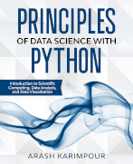

.. YA LATIF

Principles of Data Science with Python
======================================

Principles of Data Science with Python: Introduction to Scientific Computing, Data Analysis, and Data Visualization

Order at Amazon: https://www.amazon.com/dp/1735241008

In this book, readers learn about:

* Programming with the Python language
* Data science, analysis, and visualization with the Python language
* Data structure in Python
* NumPy library and NumPy arrays
* Statistical functions
* Pandas library and Pandas DataFrames
* Time-series in Python
* Matplotlib library and data visualization
* SciPy library
* Interpolation, curve fitting, root finding, and numerical integration
* Signal processing and digital filtering
* Reading and writing data files

Contents
--------

Chapter 1 Set Up Python	1
    | 1.1 Introduction to Python Language	2
    | 1.2 Install Python Directly	2
    | 1.3 Install Python Using Python Distribution	3
    | 1.4 Python IDE	4
    | 1.5 IPython and Jupyter Notebook	5
    | 1.6 Python Libraries and Packages	5
    | 1.7 Run Python Script	6

Chapter 2 Introduction to Python Programming	11
    | 2.1 Python Syntax Style	12
    | 2.2 Python Built-in Functions, Standard Libraries, and Third-Party Libraries	13
    | 2.3 Import Library	14
    | 2.4 Mathematical Operators	16
    | 2.5 Comparison Operators	18
    | 2.6 Boolean Operators	19
    | 2.7 Bitwise Operators	19
    | 2.8 Integer and Floating Point	20
    | 2.9 Complex Numbers	22
    | 2.10 Strings	23
    | 2.11 The range() Function	32
    | 2.12 The if Statement	34
    | 2.13 The for Statement	40
    | 2.14 The while Statement	44
    | 2.15 Define Function	46
    | 2.16 The *args* and **kwargs	53**
    | 2.17 Define Anonymous Function by Lambda Expression	55
    | 2.18 Underscore ( _ )	57
    | 2.19 Work with File and Directory	59

Chapter 3 Introduction to Python List, Tuple, and Dictionary	61
    | 3.1 Python Data Structures	62
    | 3.2 List	63
    | 3.3 Nested List	64
    | 3.4 Tuple	65
    | 3.5 Nested Tuple	66
    | 3.6 Dictionary	67
    | 3.7 List Indexing	69
    | 3.8 List Slicing	73
    | 3.9 Change Item Contents in List	75

Chapter 4 Working with Python List	77
    | 4.1 Copy List	78
    | 4.2 Append, Insert, and Delete List Items	79
    | 4.3 Concatenate Lists	82
    | 4.4 The len() Function	83
    | 4.5 Sort List	84
    | 4.6 The zip() Function	86
    | 4.7 The enumerate() Function	88
    | 4.8 List Comprehension	89
    | 4.9 Generator Expression	92
    | 4.10 The map() Function	94
    | 4.11 List Initialization	97
    | 4.12 Element-Wise Operation with for Statement	99
    | 4.13 Element-Wise Operation with List Comprehension	101
    | 4.14 Element-Wise Operation with map() Function	102

Chapter 5 Introduction to NumPy Library	105
    | 5.1 NumPy Library	106
    | 5.2 Install NumPy Library	106
    | 5.3 Import NumPy Library	107
    | 5.4 Vector, Matrix, Array, and Tensor	108
    | 5.5 Create NumPy Array	109
    | 5.6 Array Data Type	111
    | 5.7 Array Attributes and Methods	113
    | 5.8 Array Dimension	116
    | 5.9 Array Indexing	119
    | 5.10 Array Slicing	121
    | 5.11 Indexing by Index List and Index Array	126
    | 5.12 Boolean Indexing (Mask)	128
    | 5.13 Change Element Contents in Array	131
    | 5.14 NumPy Structured Array	132

Chapter 6 Working with NumPy Array	137
    | 6.1 Import NumPy Library	138
    | 6.2 NumPy Functions, Array Attributes, and Array Methods	138
    | 6.3 Copy Array	140
    | 6.4 Append, Insert, and Delete Array Elements	142
    | 6.5 Obtain Array Shape and Size	145
    | 6.6 Reshape Array	149
    | 6.7 Flip Array	151
    | 6.8 Add New Dimension to Array	153
    | 6.9 Concatenate and Stack Arrays	156
    | 6.10 Array Initialization	161
    | 6.11 Element-Wise Operation and Comparison	163
    | 6.12 Find Indexes	165
    | 6.13 NaN and Inf	169
    | 6.14 Generate Sequence of Numbers	170

Chapter 7 Basic Statistics with NumPy Library	175
    | 7.1 Import NumPy Library	176
    | 7.2 NumPy Array Axis	176
    | 7.3 Statistical Functions	177
    | 7.4 Sum and Mean of Array	178
    | 7.5 Minimum and Maximum of Array	180
    | 7.6 Sort Array	183
    | 7.7 Random Number	187
    | 7.8 Generate Reproducible Random Number	190
    | 7.9 Random Number (Legacy Random Generator)	191
    | 7.10 Generate Reproducible Random Number (Legacy Random Generator)	193
    | 7.11 Histogram and Probability Density Function of Dataset	195

Chapter 8 Introduction to Pandas Library	199
    | 8.1 Pandas Library	200
    | 8.2 Install Pandas Library	200
    | 8.3 Import Pandas Library	201
    | 8.4 Create Pandas Series	202
    | 8.5 Create Pandas DataFrame	204
    | 8.6 Series and DataFrame Attributes and Methods	207
    | 8.7 Series and DataFrame Indexing and Slicing	210
    | 8.8 Multi Level Indexing	215
    | 8.9 Change Item Contents in Series and DataFrame	219

Chapter 9 Working with Pandas Series and DataFrame	223
    | 9.1 Import Pandas Library	224
    | 9.2 Pandas Functions, Attributes, and Methods	224
    | 9.3 Copy Series and DataFrame	226
    | 9.4 Append, Insert, and Delete Single Row or Single Column	227
    | 9.5 Append, Insert, and Delete Multiple Rows or Multiple Columns	231
    | 9.6 Concatenate Series and DataFrames	235
    | 9.7 Merge and Join Series and DataFrames	238
    | 9.8 Reindex Data	245
    | 9.9 Shift Data	246
    | 9.10 Arithmetic and Element-Wise Operation	248
    | 9.11 Apply Function	250
    | 9.12 Group Data	253
    | 9.13 Clean and Fill Missing Data	260
    | 9.14 Rolling Window	265

Chapter 10 Date, Time, and Time-Series	273
    | 10.1 Import Libraries	274
    | 10.2 Date and Time in Python	274
    | 10.3 Date and Time in NumPy	279
    | 10.4 Date and Time in Pandas	282
    | 10.5 Generate Time-Series with Python and NumPy	284
    | 10.6 Generate Date and Time Indexes in Pandas	288
    | 10.7 Generate Time-Series with Pandas	290
    | 10.8 Indexing and Slicing Pandas Time-Series	293
    | 10.9 Shift Data in Pandas Time-Series	296
    | 10.10 Clean and Fill Missing Data in Pandas Time-Series	299
    | 10.11 Resampling Pandas Time-Series	303

Chapter 11 Introduction to Data Visualization with Matplotlib Library	313
    | 11.1 Matplotlib Library	314
    | 11.2 Install Matplotlib Library	314
    | 11.3 Import Matplotlib Library	315
    | 11.4 The Pyplot Module	316
    | 11.5 Line Plot	318
    | 11.6 Set Color	321
    | 11.7 Set Line Style and Line Width	324
    | 11.8 Add Marker	327
    | 11.9 Add Labels	329
    | 11.10 Set Axis Limits, Ticks, and Scale	331
    | 11.11 Add Grid Lines	334
    | 11.12 Add Text and Annotation	336
    | 11.13 Add Mathematical Text	339
    | 11.14 Plot Multiple Lines and Add Legend	342
    | 11.15 Create Multiple Figures	346
    | 11.16 Customize Matplotlib Style	347
    | 11.17 Seaborn Library	351

Chapter 12 Advanced Data Visualization with Matplotlib Library	355
    | 12.1 Import Matplotlib Library	356
    | 12.2 Colormaps	356
    | 12.3 Extract Colors from Colormap	359
    | 12.4 Create Colormap	361
    | 12.5 Scatter Plot	363
    | 12.6 Contour and Image Plot	367
    | 12.7 Bar Plot	370
    | 12.8 Histogram Plot	372
    | 12.9 Axes	375
    | 12.10 Create Subplots	379
    | 12.11 Create Unequal Subplots	383
    | 12.12 Procedural and Object-Oriented Interfaces	386
    | 12.13 Time-Series Plot	390
    | 12.14 The 3-Dimensional Plot	393
    | 12.15 Map Plot	396
    | 12.16 Data Visualization with Pandas	401

Chapter 13 Interpolation, Curve Fitting, Root Finding, and Numerical Integration with SciPy Library	405
    | 13.1 SciPy Library	406
    | 13.2 Install SciPy Library	406
    | 13.3 Import SciPy Library	407
    | 13.4 Generate 1-Dimensional Grid Coordinates	408
    | 13.5 Generate 2-Dimensional Grid Coordinates	409
    | 13.6 The 1-Dimensional Interpolation	412
    | 13.7 The 2-Dimensional Interpolation	415
    | 13.8 Curve Fitting	420
    | 13.9 Curve Fitting by Optimization	423
    | 13.10 Root Finding	426
    | 13.11 Solve System of Linear Equations	429
    | 13.12 Numerical Integration	431

Chapter 14 Introduction to Signal Processing	433
    | 14.1 Import SciPy Library	434
    | 14.2 Wave Function	434
    | 14.3 Sampling Frequency	436
    | 14.4 Control Data Quality	439
    | 14.5 Detrend Data	443
    | 14.6 Time and Frequency Domains	445
    | 14.7 Fourier Analysis	447
    | 14.8 Fast Fourier Transform	448
    | 14.9 Frequency Ordering of Fast Fourier Transform	449
    | 14.10 Double-Sided FFT and Single-Sided FFT	452
    | 14.11 Wave Amplitudes from FFT	456
    | 14.12 Estimate Power Spectral Density from FFT	459
    | 14.13 Estimate Power Spectral Density from Periodogram and Welch Method	463

Chapter 15 Basics of Window Function and Digital Filter	469
    | 15.1 Import SciPy Library	470
    | 15.2 Convolution	470
    | 15.3 Window Function	471
    | 15.4 Digital Filter	475
    | 15.5 Digital Filter Band-Forms	478
    | 15.6 Basic Low-Pass FIR Filter	479
    | 15.7 Basic High-Pass, Band-Pass and Band-Stop FIR Filters	483
    | 15.8 Design Basic FIR Filters with SciPy Library	485
    | 15.9 Smooth Data by Moving Average	488
    | 15.10 Smooth Data by Savitzky-Golay Filter	493
    | 15.11 Smooth Data by Butterworth Filter	496
    | 15.12 Filter Out Frequency Range from Data	499

Chapter 16 Read and Write Data Files	507
    | 16.1 Import Libraries	508
    | 16.2 Read Text and ASCII Files with Python	508
    | 16.3 Read CSV Files with Python	512
    | 16.4 Read Text, ASCII, and CSV Files with NumPy	514
    | 16.5 Read Text, ASCII, and CSV Files with Pandas	515
    | 16.6 Save and Load Data Files	517

References	521

Index	523

License
-------

CC BY-NC-SA 4.0 License

Principles of Data Science with Python: Introduction to Scientific Computing, Data Analysis, and Data Visualization

Copyright (c) 2022 Arash Karimpour

All rights reserved

Principles of Data Science with Python: Introduction to Scientific Computing, Data Analysis, and Data Visualization
© 2020 by Arash Karimpour is licensed under CC BY-NC-SA 4.0 (https://creativecommons.org/licenses/by-nc-sa/4.0/)
